## Introduction

*"At the Boys and Girls Club of Rosebud, we believe our youth are sacred.  That is why, in everything we do, we seek to empower our youth to live out their dreams.  We do this through consistent mentoring relationships, and a focus on our three priority outcomes: **academic success, good character, and healthy lifestyles**."*
*-- Glen Marshall (Executive Director)*

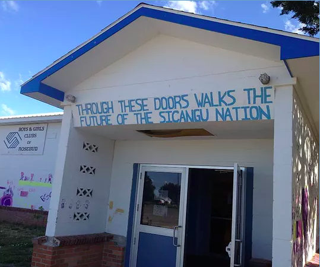

The Boys and Girls Club of Rosebud, South Dakota serves the youth of the Rosebud Sioux Tribe (Sicangu Oyate). Growing up on the reservation presents a variety of challenges. The Rosebud youth face some of the highest poverty rates in the nation. The economic and social issues reflect a great need for positive role models and high yield youth programming. The Boys and Girls Club of Rosebud is focused on providing programs that enable youth to succeed academically, develop strong character, and lead healthy lives.

In summer 2018, the Boys and Girls Club delivered a survey (via in person interview) to club members from the 3 different club sites (Mission, Rosebud, and Parmalee). The survey was designed to measure students' perception of their experience at the club. The results of the survey could be used to predict whether or not a student planned to continue coming to the club.

## Project Goals

1) Determine which features (survey questions) are most predictive of whether a student plans to continue membership at the Boys and Girls Club. Use this information to shorten the survey in the future.

2) Reduce the dimensionality of the data to get a model that best predicts whether or not a student plans to continue coming to the Boys and Girls Club.

## Data and EDA

Two separate surveys were administered. Student age 7 and younger were given a shorter survey version. Club members age 8+ received the following Teen/Upper Elementary survey (30 items):  

| Question                                                                                                                 | Response Space                                                    | Response Distribution  |
|--------------------------------------------------------------------------------------------------------------------------|-------------------------------------------------------------------|------------------------|
| 1. I feel respected by staff members when I am at the Club                                                               | 5 Pt. Likert (SA,A,N,D,SD)                                        | 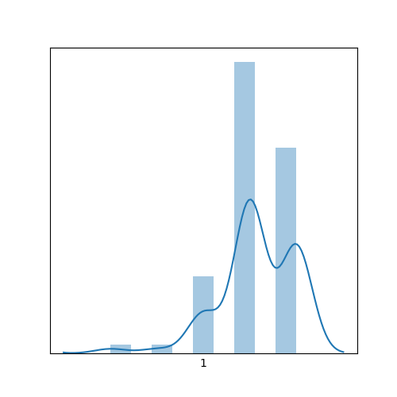      |
| 2. I feel respected by fellow Club members when I am at the Club                                                         | 5 Pt. Likert (SA,A,N,D,SD)                                        |       |
| 3. I feel safe when I am at the Club                                                                                     | All of the time / Most times / Some times / Never                 |       |
| 4. When someone tries to tease, hurt, or is mean to a member at the Club, I believe a staff member will stop that person | All of the time / Most times / Some times / Never                 |       |
| 5. At the Club, I have a good time                                                                                       | 5 Pt. Likert (SA,A,N,D,SD)                                        | 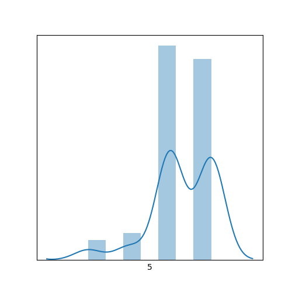      |
| 6. I can talk to staff if I have a problem                                                                               | 5 Pt. Likert (SA,A,N,D,SD)                                        |       |
| 7. I feel comfortable talking to any staff member at the Boys and Girls Club                                             | 5 Pt. Likert (SA,A,N,D,SD)                                        | 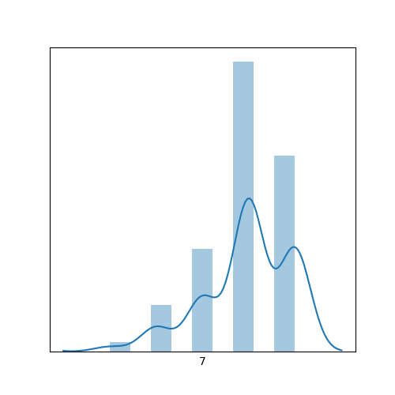      |
| 8. I believe all staff members care about me and my experience at the Club                                               | 5 Pt. Likert (SA,A,N,D,SD)                                        |       |
| 9. There are clear expectations for me during Club time                                                                  | 5 Pt. Likert (SA,A,N,D,SD)                                        |       |
| 10. Staff members recognize me when I do a task well or display good behavior                                            | 5 Pt. Likert (SA,A,N,D,SD)                                        |       |
| 11. I feel like going to the Club helps me learn more and become smarter                                                 | 5 Pt. Likert (SA,A,N,D,SD)                                        |       |
| 12. The Club helps me get better at math                                                                                 | 5 Pt. Likert (SA,A,N,D,SD)                                        |       |
| 13. The Club helps me get better at reading                                                                              | 5 Pt. Likert (SA,A,N,D,SD)                                        | 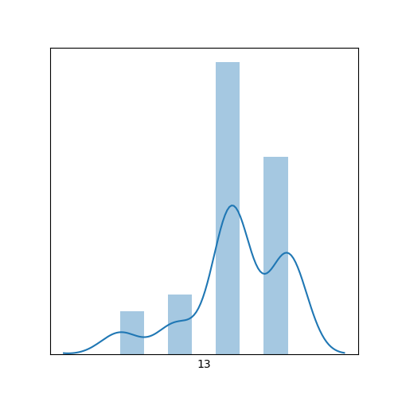      |
| 14. The Club gives me feedback about how I’m growing in my academics                                                     | 5 Pt. Likert (SA,A,N,D,SD)                                        | 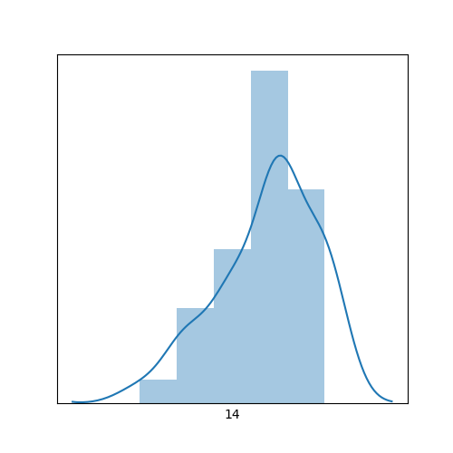      |
| 15. I feel like going to the Club helps me develop my social skills with other students                                  | 5 Pt. Likert (SA,A,N,D,SD)                                        |       |
| 16. How far in school do you think you will get?                                                                         | Grade 8 / Some high school / High School Diploma / College Degree | 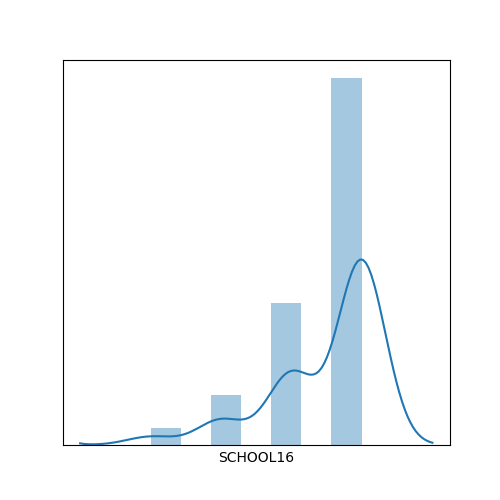      |
| 17. I feel comfortable and confident in expressing myself at the Club                                                    | 5 Pt. Likert (SA,A,N,D,SD)                                        | 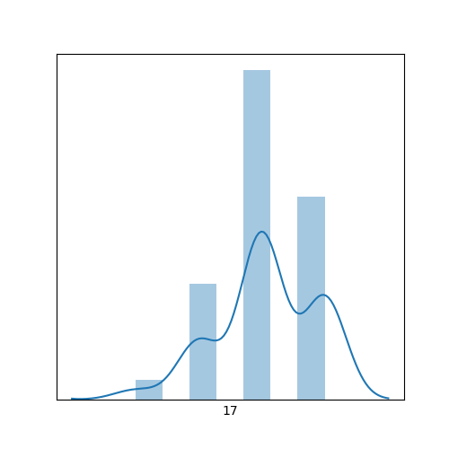      |
| 18. The Club helps me eat better                                                                                         | 5 Pt. Likert (SA,A,N,D,SD)                                        |       |
| 19. The Club helps me exercise more                                                                                      | 5 Pt. Likert (SA,A,N,D,SD)                                        |       |
| 20. The Club helps me learn about the importance of eating healthy and drinking water                                    | 5 Pt. Likert (SA,A,N,D,SD)                                        |       |
| 21. The Club helps me to set personal goals                                                                              | 5 Pt. Likert (SA,A,N,D,SD)                                        |       |
| 22. The Club helps me to reach my personal goals                                                                         | 5 Pt. Likert (SA,A,N,D,SD)                                        |       |
| 23. I feel the Club celebrates who I am as a person                                                                      | 5 Pt. Likert (SA,A,N,D,SD)                                        |       |
| 24. The Club helps me to feel proud about who I am                                                                       | 5 Pt. Likert (SA,A,N,D,SD)                                        |       |
| 25. The Club helps me build positive feelings about my tribal and/or racial identity                                     | 5 Pt. Likert (SA,A,N,D,SD)                                        |       |
| 26. The Club helps me to learn about Lakota language and culture                                                         | 5 Pt. Likert (SA,A,N,D,SD)                                        |       |
| 27. The Club helps me learn about myself, my family, and my tribe                                                        | 5 Pt. Likert (SA,A,N,D,SD)                                        | 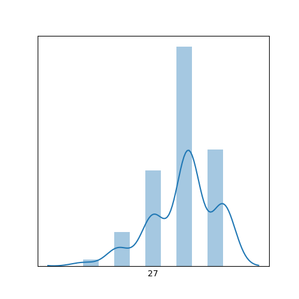      |
| 28. I’m glad I’m a Boys and Girls Club member                                                                            | 5 Pt. Likert (SA,A,N,D,SD)                                        | 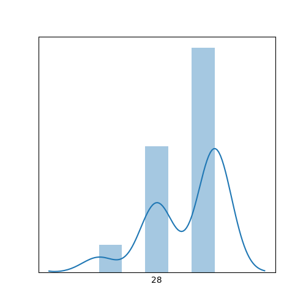      |
| **29. I want to continue to be a Boys and Girls Club member after this summer**                                              | 5 Pt. Likert (SA,A,N,D,SD)                                        |       |
| 30. I have fun and enjoy my time at the Boys and Girls Club                                                              | 5 Pt. Likert (SA,A,N,D,SD)                                        | 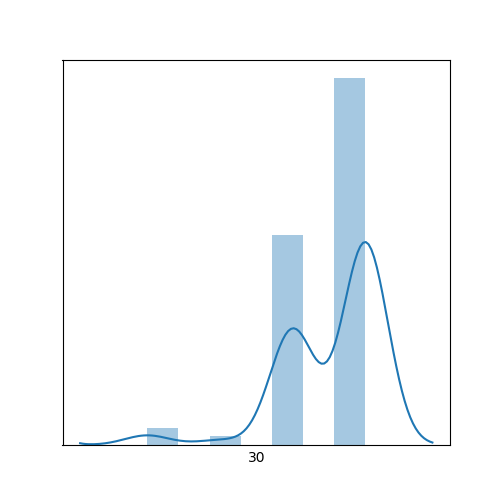      |

Survey responses were mapped to the following values:
* Questions 3 and 4:
All of the time = 4, Most times = 3, Some times = 2, Never = 1
* Question 16:
8th Grade = 1, Some high school = 2, High School Diploma = 3, College Degree = 4
* All other questions:
Strongly Agree = 5, Agree = 4, Neutral = 3, Disagree = 2, Strongly Disagree = 1.

The survey also collected information on each participant's gender identity, age, grade in Fall '18, and race/ethnicity.

### Participant Demographics

93 club members completed the Teen/Upper Elementary survey.

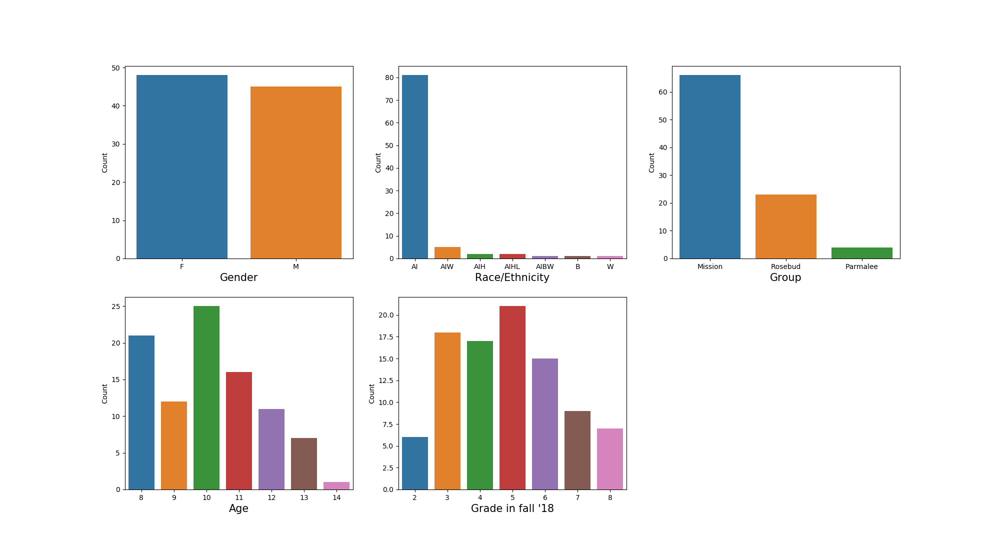

Female and male classes are well balanced.

Age appears to be bimodal (8- and 10-years-old).

Most club members attend the Mission club. Mission, SD has a relatively large population for a reservation community (pop. 1,240) and has the largest elementary and middle school on the reservation.

Most club members identify as American Indian.

#### Demographics by target variable (planned retention)

### Missing Data

The following table shows the questions where one or more data points were missing as well as the number of missing data points:

| Question                                                                             | # NA |
|--------------------------------------------------------------------------------------|------|
| 2. I feel respected by fellow Club members when I am at the Club                     | 1    |
| 3. I feel safe when I am at the Club                                                 | 1    |
| 7. I feel comfortable talking to any staff member at the Boys and Girls Club         | 1    |
| 22. The Club helps me to reach my personal goals                                     | 1    |
| 23. I feel the Club celebrates who I am as a person                                  | 1    |
| 25. The Club helps me build positive feelings about my tribal and/or racial identity | 6    |
| 26. The Club helps me to learn about Lakota language and culture                     | 1    |

The missing data were not from the same observation. Also, 6 of the 7 columns with missing data only had 1 observation missing. For this reason, I decided to deal with missing data by imputing the median of the column.

The median was imputed because the data in the questions with na's were skewed (as seen in the distribution of answers to Question 7 "I feel comfortable talking to any staff member at the Boys and Girls Club").

### EDA Take-Aways
* The majority of survey questions are skewed left. All survey questions were worded positively ("strongly agree" is always strongly agreeing to a positive attribute). This indicates that the most common response to a question was often positive (agree or strongly agree). Yay!

* 63% of survey participants believe they will receive a college degree.

* A quick look at how the club is meeting priority outcomes:
  * Academic Success: 77% of survey respondents agree or strongly agree that "going to the Club helps me learn more and become smarter."
  * Good Character/ Citizenship: 81% of survey respondents agree or strongly agree that "going to the Club helps me develop my social skills with other students."
  * Healthy Lifestyles: 85% of survey respondents agree or strongly agree that "the Club helps me exercise more."

## Dimensionality Reduction

### Principal Components Analysis (PCA) via Singular Value Decomposition

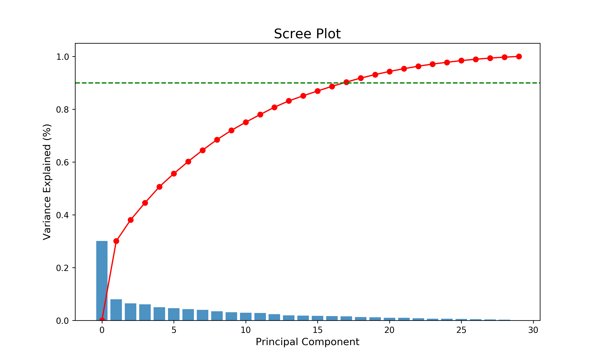

We will need to use ~15 principle components (orthogonal linear combinations of the data) to explain 90% of the variance in the data.

Principle component 1 explains ~30% of the variance in the data. However, the loadings on the questions are not helpful. They are all negative (what??) and also close together. There are not clear groupings of questions which explain this principle component.

Loadings: [-0.17,-0.17,-0.18, -0.18,-0.19,-0.19,-0.19,-0.19,-0.19,-0.19, -0.19,-0.19, -0.19,-0.19,-0.19,-0.19,-0.19,-0.2,-0.2,-0.2,-0.2,-0.2,-0.2,-0.2,-0.2,-0.21,-0.21]

### Non_Negative Matrix Factorization

Topic 1 loads strongly on the following questions:

* 30. I have fun and enjoy my time at the Boys and Girls Club (3.22)
* 28. I’m glad I’m a Boys and Girls Club member (3.01)
* 5. At the Club, I have a good time (2.63)

Topic 1 may be labeled **"Fun."**

Topic 2 loads strongly on the following questions:

* 26. The Club helps me to learn about Lakota language and culture (3.02)
* 23. I feel the Club celebrates who I am as a person (2.91)
* 27. The Club helps me learn about myself, my family, and my tribe (2.56)
* 8. I believe all staff members care about me and my experience at the Club (2.20)

This latent topic may be labeled **"Identity Validation."**

Topic 3 loads strongly on the following questions:

* 2. I feel respected by fellow Club members when I am at the Club (2.34)
* 15. I feel like going to the Club helps me develop my social skills with other students (2.15)
* 24. The Club helps me to feel proud about who I am (1.36)
* 9. There are clear expectations for me during Club time (1.32)

This latent topic may be labeled **"Social Skills Development.""**

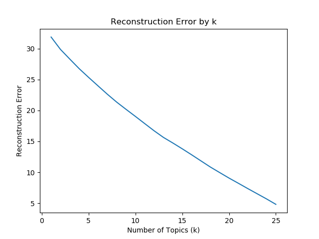

The loadings on the questions are much more interpretable in NMF. The positive loadings allow the questions to be grouped into latent topics. However, it is not clear how many latent topics should be used to predict planned retention. There is no clear drop in the Reconstruction Error elbow plot (above).

### Dimensionality Reduction via Random Forest Classifier Feature Importances

I fit a Random Forest Classifier on all 29 questions using balanced classes (planning to return vs. not planning to return). The feature importances are plotted below:

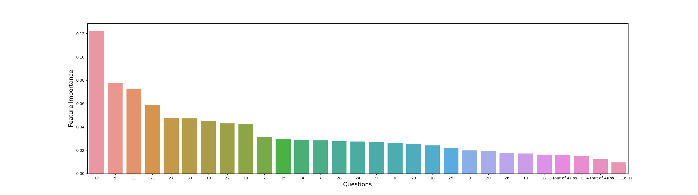

The most important questions for predicting planned retention are as follows (in order of feature importance):
* 17.I feel comfortable and confident in expressing myself at the Club
* **5.At the Club, I have a good time -- (Fun)**
* 11.I feel like going to the Club helps me learn more and become smarter
* 21.The Club helps me to set personal goals
* **27.The Club helps me learn about myself, my family, and my tribe -- (Identity Validation)**
* **30. I have fun and enjoy my time at the Boys and Girls Club -- (Fun)**
* 13.The Club helps me get better at reading
* 22.The Club helps me to reach my personal goals
* 10.Staff members recognize me when I do a task well or display good behavior
* **2.I feel respected by fellow Club members when I am at the Club -- (Social Skill Development)**

## Model Selection

I performed KFold cross validation to pick the set of features that would most accurately predict planned retention. I used random forest classification models with 100 trees and balanced classes.

| Random Forest Classifier Features               | KFold Cross Validation Score (Average Accuracy) |
|-------------------------------------------------|----------------------------|
| All Questions + Gender + Club + Age             | .783                       |
| Principle Components (15) + Gender + Club + Age | .739                       |
| Top 10 Questions + Gender + Club + Age          | .812                       |

The best performing model used the top 10 most important questions and demographic information to predict planned retention with 81.2% accuracy.

## Future Direction

With more time I would like to:
* Use grid searching to optimize random forest hyper-parameters for better model selection (vs. using the same hyper-parameters for all models).
* Try different classifiers besides random forests (Logistic Regression, Gradient Boosting, etc.)
