| Question                                                                                                                 | Response Space                                                    | Response Distribution  |
|--------------------------------------------------------------------------------------------------------------------------|-------------------------------------------------------------------|------------------------|
| 1. I feel respected by staff members when I am at the Club                                                               | 5 Pt. Likert (SA,A,N,D,SD)                                        |       |
| 2. I feel respected by fellow Club members when I am at the Club                                                         | 5 Pt. Likert (SA,A,N,D,SD)                                        | 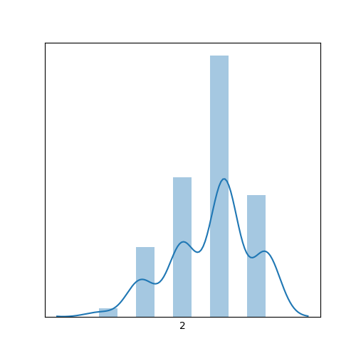      |
| 3. I feel safe when I am at the Club                                                                                     | All of the time / Most times / Some times / Never                 | 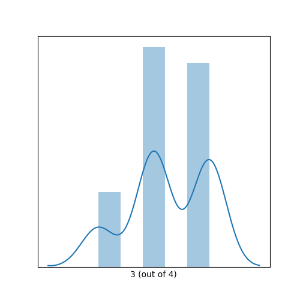      |
| 4. When someone tries to tease, hurt, or is mean to a member at the Club, I believe a staff member will stop that person | All of the time / Most times / Some times / Never                 |       |
| 5. At the Club, I have a good time                                                                                       | 5 Pt. Likert (SA,A,N,D,SD)                                        |       |
| 6. I can talk to staff if I have a problem                                                                               | 5 Pt. Likert (SA,A,N,D,SD)                                        | 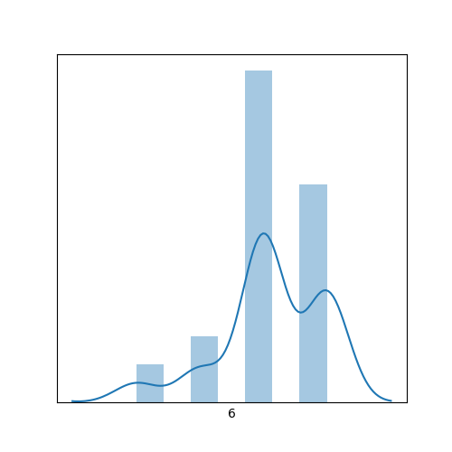      |
| 7. I feel comfortable talking to any staff member at the Boys and Girls Club                                             | 5 Pt. Likert (SA,A,N,D,SD)                                        |       |
| 8. I believe all staff members care about me and my experience at the Club                                               | 5 Pt. Likert (SA,A,N,D,SD)                                        |       |
| 9. There are clear expectations for me during Club time                                                                  | 5 Pt. Likert (SA,A,N,D,SD)                                        | 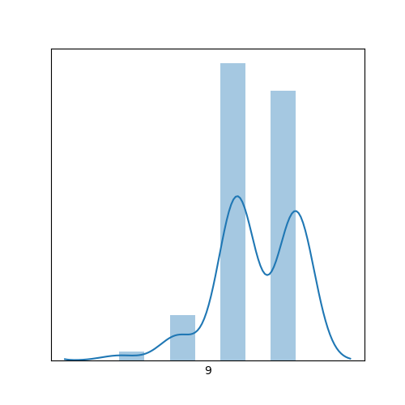      |
| 10. Staff members recognize me when I do a task well or display good behavior                                            | 5 Pt. Likert (SA,A,N,D,SD)                                        | 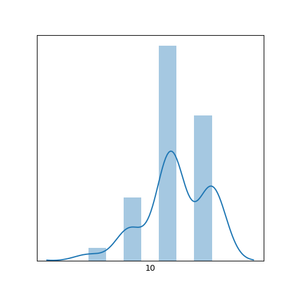      |
| 11. I feel like going to the Club helps me learn more and become smarter                                                 | 5 Pt. Likert (SA,A,N,D,SD)                                        | 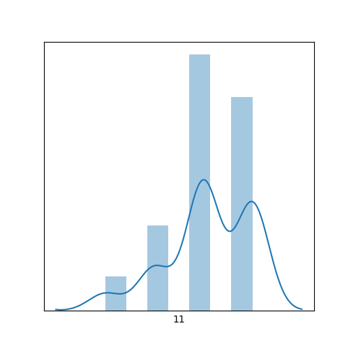      |
| 12. The Club helps me get better at math                                                                                 | 5 Pt. Likert (SA,A,N,D,SD)                                        |       |
| 13. The Club helps me get better at reading                                                                              | 5 Pt. Likert (SA,A,N,D,SD)                                        |       |
| 14. The Club gives me feedback about how I’m growing in my academics                                                     | 5 Pt. Likert (SA,A,N,D,SD)                                        |       |
| 15. I feel like going to the Club helps me develop my social skills with other students                                  | 5 Pt. Likert (SA,A,N,D,SD)                                        |       |
| 16. How far in school do you think you will get?                                                                         | Grade 8 / Some high school / High School Diploma / College Degree |       |
| 17. I feel comfortable and confident in expressing myself at the Club                                                    | 5 Pt. Likert (SA,A,N,D,SD)                                        |       |
| 18. The Club helps me eat better                                                                                         | 5 Pt. Likert (SA,A,N,D,SD)                                        | 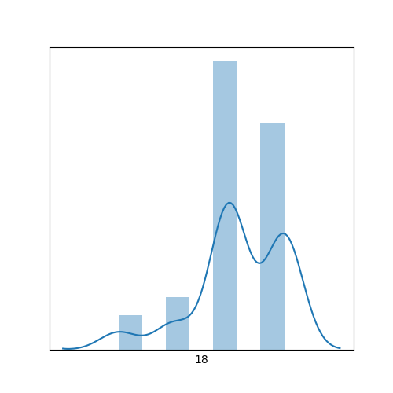      |
| 19. The Club helps me exercise more                                                                                      | 5 Pt. Likert (SA,A,N,D,SD)                                        | 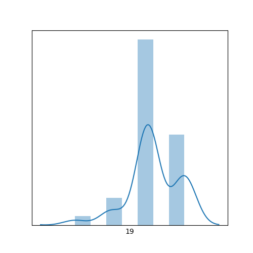      |
| 20. The Club helps me learn about the importance of eating healthy and drinking water                                    | 5 Pt. Likert (SA,A,N,D,SD)                                        | 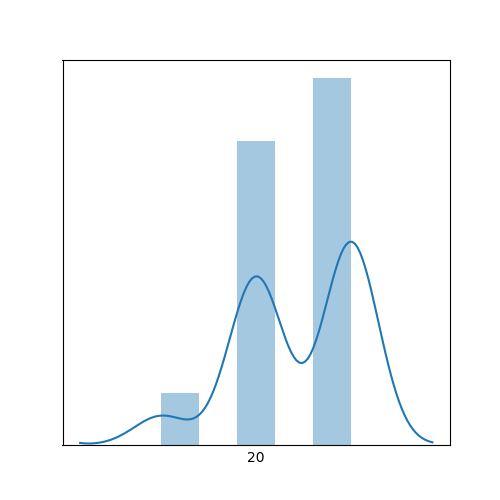      |
| 21. The Club helps me to set personal goals                                                                              | 5 Pt. Likert (SA,A,N,D,SD)                                        | 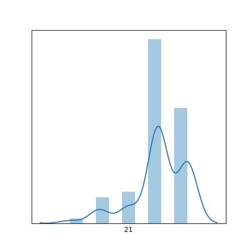      |
| 22. The Club helps me to reach my personal goals                                                                         | 5 Pt. Likert (SA,A,N,D,SD)                                        | 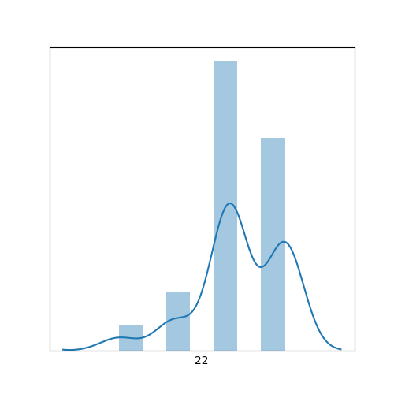      |
| 23. I feel the Club celebrates who I am as a person                                                                      | 5 Pt. Likert (SA,A,N,D,SD)                                        | 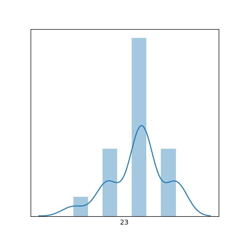      |
| 24. The Club helps me to feel proud about who I am                                                                       | 5 Pt. Likert (SA,A,N,D,SD)                                        | 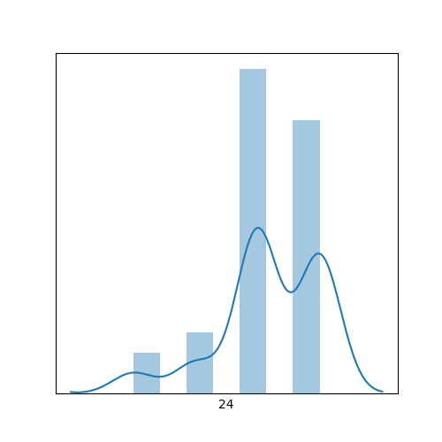      |
| 25. The Club helps me build positive feelings about my tribal and/or racial identity                                     | 5 Pt. Likert (SA,A,N,D,SD)                                        | 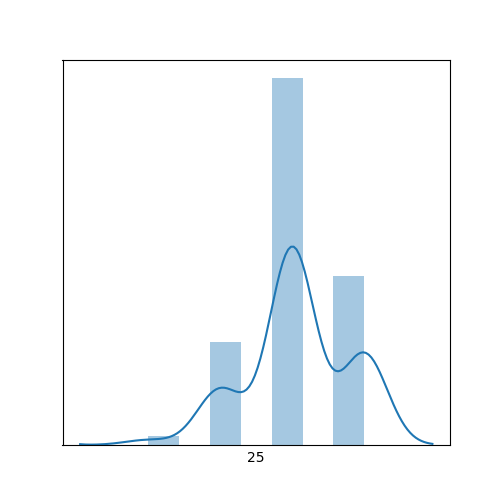      |
| 26. The Club helps me to learn about Lakota language and culture                                                         | 5 Pt. Likert (SA,A,N,D,SD)                                        | 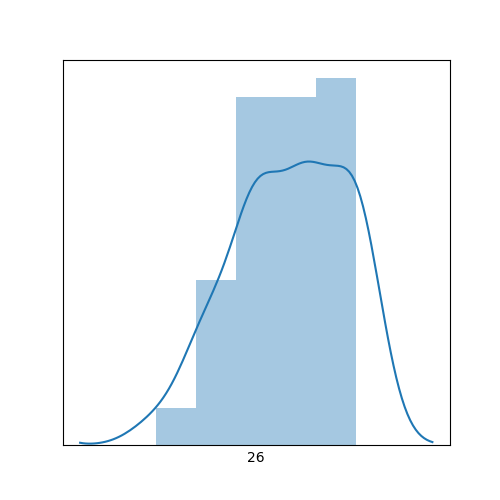      |
| 27. The Club helps me learn about myself, my family, and my tribe                                                        | 5 Pt. Likert (SA,A,N,D,SD)                                        |       |
| 28. I’m glad I’m a Boys and Girls Club member                                                                            | 5 Pt. Likert (SA,A,N,D,SD)                                        |       |
| **29. I want to continue to be a Boys and Girls Club member after this summer**                                              | 5 Pt. Likert (SA,A,N,D,SD)                                        |       |
| 30. I have fun and enjoy my time at the Boys and Girls Club                                                              | 5 Pt. Likert (SA,A,N,D,SD)                                        |       |
